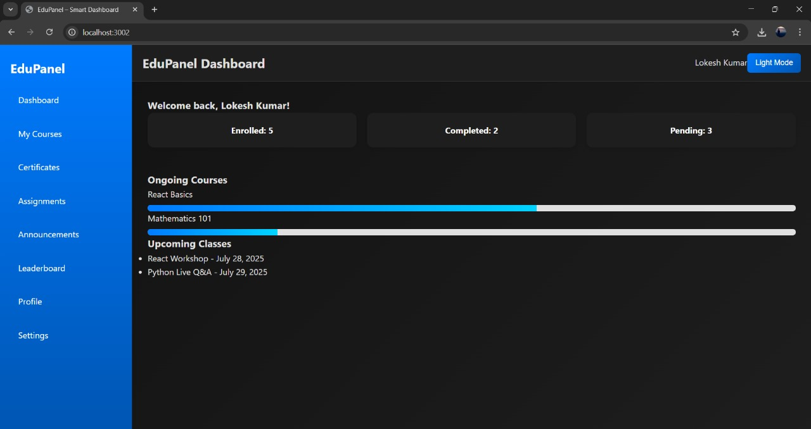
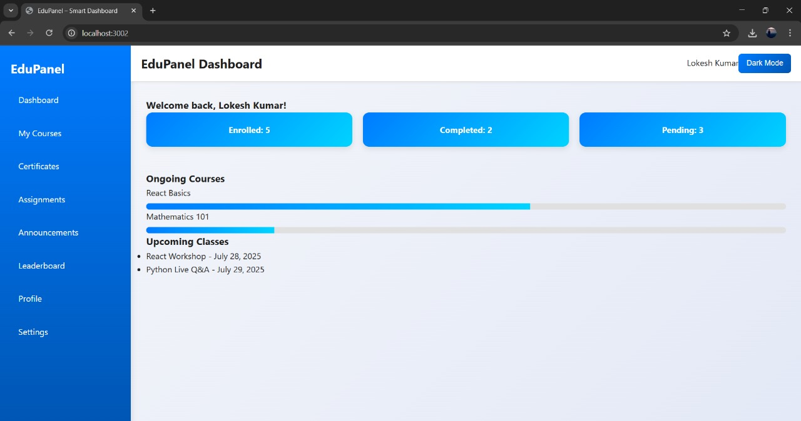
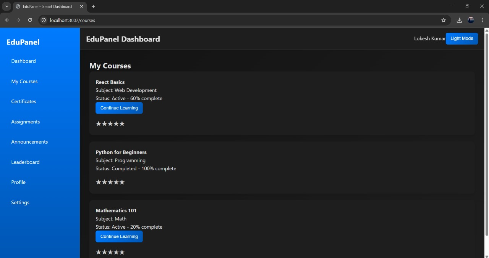
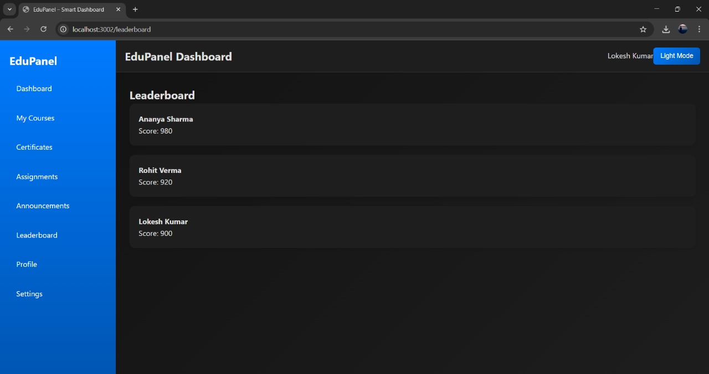

# 📚 EduNet Dashboard

EduNet Dashboard is a **React.js-based education management system** that provides students with an interactive platform to track their courses, assignments, certificates, announcements, and leaderboard rankings. The app also includes **dark mode**, **progress tracking**, and **rating system** for courses.

---

## ✨ Features
✔ **Dashboard Overview** – View enrolled, completed, and pending courses  
✔ **My Courses** – Continue learning and rate courses  
✔ **Certificates** – View and download course completion certificates (PDFs)  
✔ **Assignments & Quizzes** – Track and start pending assignments  
✔ **Announcements** – Stay updated with important notifications  
✔ **Leaderboard** – See top-performing students  
✔ **Profile Section** – View and edit user profile details  
✔ **Settings** – Toggle Dark/Light mode  
✔ **Responsive UI** – Works on desktop and mobile  

---

## 🛠 Tech Stack
- **React.js** – Component-based UI
- **React Router** – For navigation between pages
- **Custom CSS** – Modern dashboard styling
- **JavaScript (ES6)**

---
## 📸 Screenshots

> Store these images in a /screenshots/ folder inside your root project and update if needed.

### 🏠 Home Page

### 🏠 Home Page light mode

### 📜 My courses

### Assignments

### Leaderboard

